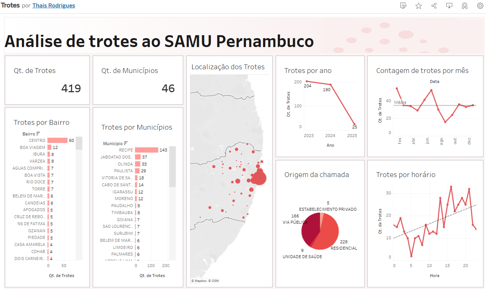

# Análise das ocorrências de trote para o SAMU Pernambuco

O projeto de análise das ocorrências de trote ao SAMU em Pernambuco, tem como objetivo o monitoramento e a análise de dados por meio do Tableau, com informações fornecidas pela Prefeitura do Recife.

Dados abertos Recife (Serviço de Atendimento Móvel de Urgência - SAMU)
[2024](http://dados.recife.pe.gov.br/dataset/servico-de-atendimento-movel-de-urgencia-samu-2025/), [2024](http://dados.recife.pe.gov.br/dataset/servico-de-atendimento-movel-de-urgencia-samu-2024), [2023](http://dados.recife.pe.gov.br/dataset/servico-de-atendimento-movel-de-urgencia-samu-2023)

## Visualização e análise do relatório

Se você precisasse combater trotes, quais estratégias adotaria?

Um bom começo é analisar dados. O SAMU de Pernambuco categoriza os atendimentos de trotes, fornecendo informações detalhadas sobre o local e o período em que ocorrem.

O Munícipio de Recife lidera com 143 trotes, seguido por Jaboatão dos Guararapes (37), Olinda (33) e Paulista (29). Esses episódios ocorrem com maior intensidade nos meses de maio, junho e janeiro, possivelmente relacionados ao período de férias escolares e festividades.

Além disso, a análise da linha de tendência revela um aumento nos trotes, especialmente no período da tarde e à noite, sendo a maioria originada de chamadas residenciais.

Esses insights reforçam a necessidade de ações de conscientização em áreas e períodos críticos, evitando assim o desperdício de recursos públicos essenciais e melhorando a eficiência do atendimento.

- Projeto no Tableau Public: [Trotes](https://public.tableau.com/app/profile/thais.nicole.rodrigues7737/viz/Trotes/Painel1#1)

## Tecnologias Utilizadas
- **Tableau** (Visualização de dados)

## Estrutura de pastas
- **visualizacoes/**  Guarda gráficos e dashboards gerados.
